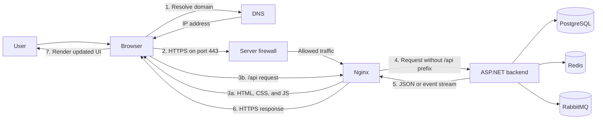
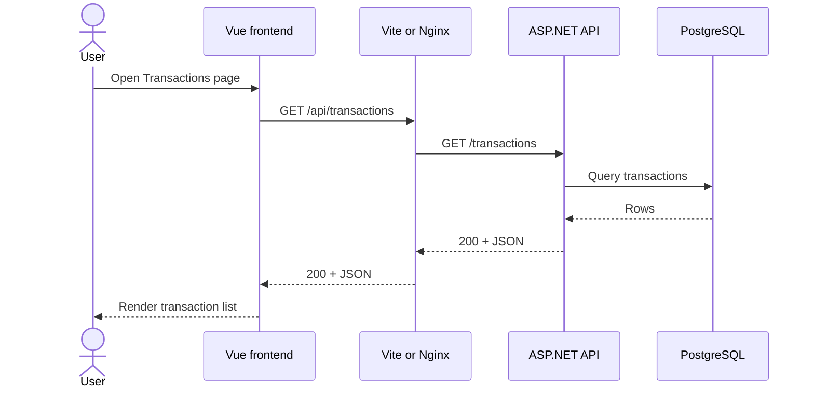
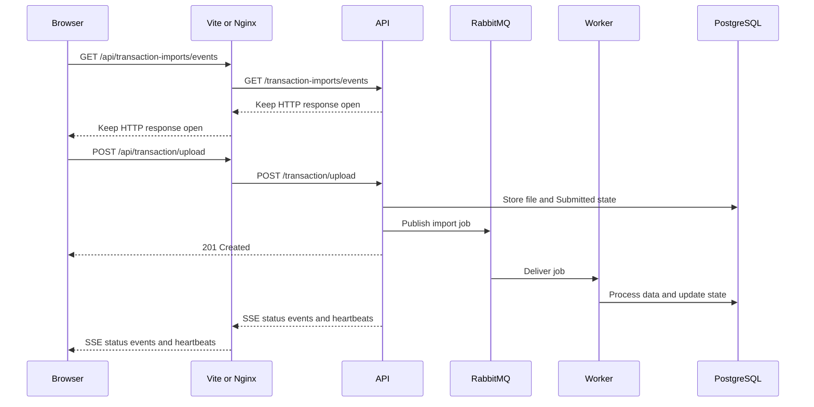
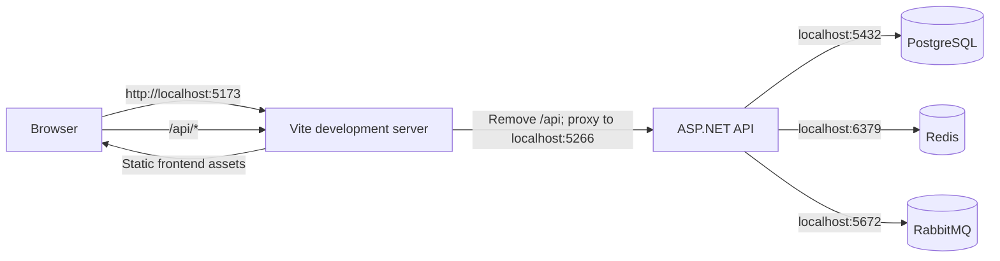

# How the system communicates

This guide explains how DNS, HTTP, a firewall, Nginx, the browser, the frontend, and the backend fit together to run Finance Manager. It also distinguishes the current local development setup from a possible production setup.

## The complete request path

In a typical production deployment, a request follows this path:



For example, when a user opens `https://finance.example.com/transactions`:

1. DNS translates `finance.example.com` into the public IP address of the server.
2. The browser opens a connection to that IP, normally using HTTPS on TCP port 443.
3. The server firewall accepts the connection because port 443 is allowed.
4. Nginx receives the request and returns the compiled Vue application.
5. The Vue application runs in the browser and requests `/api/transactions`.
6. Nginx forwards that request to the ASP.NET API and removes `/api`, so the backend receives `GET /transactions`.
7. The backend reads data from PostgreSQL and returns JSON.
8. The response travels back through Nginx to the browser, and Vue updates the page.

## Responsibility of each component

| Component | Responsibility | What it does not do |
| --- | --- | --- |
| DNS | Maps a domain name to an IP address. | It does not forward HTTP requests or choose an API route. |
| HTTP/HTTPS | Defines how requests and responses are exchanged. HTTPS also encrypts the connection with TLS. | It does not decide which application handles a request. |
| Firewall | Allows or blocks network traffic by address, protocol, and port. | It does not understand Vue components or business rules. |
| Nginx | Acts as the public web server and reverse proxy. It can terminate TLS, serve frontend files, and forward `/api` requests. | It does not implement Finance Manager business rules. |
| Browser | Resolves the domain, makes HTTP requests, runs JavaScript, and renders the user interface. | It should not connect directly to PostgreSQL, Redis, or RabbitMQ. |
| Frontend | The Vue application that displays data, collects input, and calls the API. | It does not have direct access to backend storage. |
| Backend | The ASP.NET application that validates requests, applies business rules, and coordinates infrastructure. | It does not render the Vue user interface. |

## DNS

DNS is the internet's address book. A production domain normally has:

- an `A` record pointing to the server's IPv4 address; and/or
- an `AAAA` record pointing to the server's IPv6 address.

The browser resolves the domain before it can connect. DNS is usually not involved after the connection has been established, and it does not see paths such as `/api/transactions`.

Local development normally uses `localhost`, which the operating system resolves to the local computer (`127.0.0.1` or `::1`) without public DNS.

## HTTP and HTTPS

An HTTP request contains a method, path, headers, and sometimes a body. A response contains a status code, headers, and sometimes a body.

Example frontend request:

```http
GET /api/transactions?page=1&limit=20 HTTP/1.1
Host: finance.example.com
Accept: application/json
```

After proxying, the backend handles it as:

```http
GET /transactions?page=1&limit=20 HTTP/1.1
```

The backend returns a status such as `200 OK`, `201 Created`, `400 Bad Request`, or `500 Internal Server Error`, usually with a JSON body. The frontend checks the status, parses the body, and either updates the screen or shows an error.

HTTPS is HTTP protected by TLS. It prevents other parties on the network from easily reading or changing traffic. Production traffic should use HTTPS; Nginx commonly owns the TLS certificate and forwards requests to the API over a private network.

## Firewall

The firewall is the network gate in front of the processes. A production server would normally expose only:

| Port | Purpose | Public? |
| --- | --- | --- |
| `80/tcp` | Optional HTTP entry point, usually redirected to HTTPS. | Yes |
| `443/tcp` | HTTPS traffic to Nginx. | Yes |
| API internal port | Nginx-to-backend communication. | No |
| `5432/tcp` | PostgreSQL. | No |
| `6379/tcp` | Redis. | No |
| `5672/tcp` | RabbitMQ protocol. | No |
| `15672/tcp` | RabbitMQ management UI. | No, except through controlled administration access. |

Keeping the database and message services private ensures that only the backend can use them. The `docker-compose.yml` file publishes these infrastructure ports to the host for local development; that is convenient locally but is not a recommended public production firewall policy.

## Nginx

Nginx is not currently configured in this repository. During local development, Vite performs the reverse-proxy role. In production, Nginx could:

- listen on ports 80 and 443;
- manage the HTTPS certificate;
- serve the built Vue files from `client/dist`;
- return `index.html` for Vue Router routes;
- forward `/api/*` to the ASP.NET backend; and
- keep Server-Sent Events unbuffered so import updates arrive immediately.

The following is an illustrative configuration, not a file currently used by the project:

```nginx
server {
    listen 443 ssl;
    server_name finance.example.com;

    root /var/www/finance-manager;
    index index.html;

    location / {
        try_files $uri $uri/ /index.html;
    }

    location /api/ {
        proxy_pass http://finance-api:8080/;
        proxy_http_version 1.1;
        proxy_set_header Host $host;
        proxy_set_header X-Real-IP $remote_addr;
        proxy_set_header X-Forwarded-For $proxy_add_x_forwarded_for;
        proxy_set_header X-Forwarded-Proto $scheme;
    }

    location = /api/transaction-imports/events {
        proxy_pass http://finance-api:8080/transaction-imports/events;
        proxy_http_version 1.1;
        proxy_set_header Host $host;
        proxy_set_header X-Forwarded-For $proxy_add_x_forwarded_for;
        proxy_set_header X-Forwarded-Proto $scheme;
        proxy_buffering off;
        proxy_cache off;
        proxy_read_timeout 1h;
    }
}
```

The trailing slash in `proxy_pass http://finance-api:8080/` is significant: with the `location /api/` block, it makes `/api/transactions` become `/transactions`, matching the backend's current controller routes.

Using one public origin for both the frontend and API also avoids a cross-origin browser request. The backend does not currently configure CORS, so directly serving the frontend and API from different origins would require an intentional CORS configuration.

## Browser and frontend

The frontend is a Vue 3 application built with Vite. The browser first downloads its HTML, JavaScript, CSS, images, and fonts. It then executes the JavaScript locally.

The API wrapper in `client/src/api/http.ts` uses the relative base path `/api`. Because it is relative, the browser sends requests back to the same scheme, host, and port that served the page. The proxy decides how to reach the backend.

Typical communication looks like this:



The browser never receives database credentials. It knows only the public URLs and the data returned by the API.

## Backend and internal services

The backend is an ASP.NET application. Its controllers expose routes such as `/dashboard`, `/transactions`, `/person`, and `/transaction/upload`. Services apply application rules, and Entity Framework Core reads and writes PostgreSQL.

The backend also connects to:

- **PostgreSQL** for persistent transactions, people, files, and import state;
- **RabbitMQ** to queue CSV import jobs so the upload request does not wait for parsing; and
- **Redis**, for which a connection is registered during application startup, although the current documented request flows do not yet use it as their source of data.

These are backend-to-infrastructure connections. They do not pass through DNS for the public website, the browser, the frontend, or Nginx. In a container or production network, the backend would normally address them using private service names.

## Live import updates

Import status uses Server-Sent Events (SSE), which is a long-lived HTTP response:



Unlike a normal request, the SSE response remains open. The API sends a heartbeat when no status has changed, and the browser reconnects automatically after a connection failure. A production Nginx proxy must not buffer this response, or updates may appear late.

## What runs in local development today

The current local topology is:



The exact responsibilities are:

1. `docker compose up -d` starts PostgreSQL, Redis, and RabbitMQ.
2. `dotnet run` starts the API. The HTTP development profile listens on `http://localhost:5266`; the HTTPS profile also uses `https://localhost:7026`.
3. `npm run dev` in `client` starts Vite, normally on `http://localhost:5173`.
4. The browser downloads the Vue application from Vite.
5. Frontend calls to `/api/*` return to Vite.
6. `client/vite.config.ts` proxies them to `http://localhost:5266` by default and removes `/api`.

Local development therefore does not require public DNS, a public firewall rule, or Nginx. Those components become relevant when the application is deployed for users on another machine or over the internet.

## A concrete write example

When a user creates a transaction:

1. Vue serializes the form as JSON and sends `POST /api/transaction`.
2. Vite locally, or Nginx in production, forwards it as `POST /transaction`.
3. ASP.NET selects `CreateTransactionController` from the HTTP method and path.
4. Request validation rejects invalid data with a `400` response.
5. The transaction service stores valid data in PostgreSQL.
6. The API returns the created transaction with `201 Created`.
7. The frontend parses the JSON and refreshes the visible state.

This separation is important: the frontend owns presentation, the backend owns validation and business rules, and PostgreSQL owns durable application data.

## Code and configuration map

- Frontend HTTP wrapper: `client/src/api/http.ts`
- Frontend API functions and SSE connection: `client/src/api/finance.ts`
- Local development proxy: `client/vite.config.ts`
- Backend startup and service connections: `api/Program.cs`
- Backend routes: `api/Controllers`
- Local API ports: `api/Properties/launchSettings.json`
- Local infrastructure and published ports: `docker-compose.yml`
- Detailed asynchronous import flow: `docs/features/file-processing.md`
