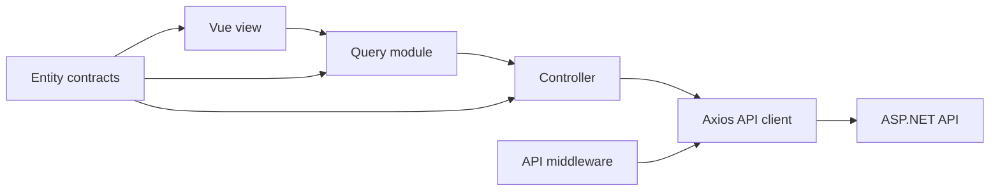

# Client data-access pattern

The client separates API contracts, HTTP operations, server-state management, and Vue presentation into distinct layers. New client-side API features should follow this dependency flow:



The allowed direction is:

```text
views -> queries -> controllers -> api -> backend
              \-> entities <-/
```

A lower layer must not import a higher layer. In particular, controllers must not import queries or views, and views must not call controllers or the Axios client directly.

## Directory responsibilities

| Directory | Responsibility |
| --- | --- |
| `client/src/entities` | TypeScript contracts for domain entities, request payloads, filters, and API responses. |
| `client/src/controllers` | Typed HTTP operations that interact with the ASP.NET API. |
| `client/src/queries` | TanStack Query queries, mutations, query keys, cache updates, and invalidation rules. |
| `client/src/views` | Vue page components, form state, display state, and user interaction. |
| `client/src/api` | Shared Axios instance and low-level request helper. |
| `client/src/api/middlewares` | Axios request or response middleware shared by all controllers. |

## Entities

All client-side API contracts belong in `client/src/entities`. Keep each domain in its own file, named after the primary entity or contract:

```text
entities/
  Entity.ts
  PersonEntity.ts
  TransactionEntity.ts
  TransactionPersonEntity.ts
  TransactionImportEntity.ts
  Dashboard.ts
```

An entity file may contain the closely related contracts for that domain. For example, `PersonEntity.ts` contains `PersonEntity`, `PersonPayload`, and `ListPersonResponse`. `TransactionEntity.ts` contains the transaction entity, list parameters, list response, payload, and composed transaction/person response.

Use `Entity.ts` for shared primitives such as `Id` and `TimestampedEntity`. Do not put HTTP calls, TanStack Query hooks, Vue refs, formatting, or UI behavior in an entity file.

Example:

```ts
import type { TimestampedEntity } from './Entity'

export interface AccountEntity extends TimestampedEntity {
  name: string
}

export interface AccountPayload {
  name: string
}
```

## Controllers

An API-backed domain resource should have a corresponding controller under `client/src/controllers`. A controller:

- imports its request and response types from `entities`;
- calls the shared `apiRequest` helper;
- defines endpoint paths, methods, query parameters, and request bodies;
- returns typed promises; and
- contains no Vue or TanStack Query code.

Related response or projection types that do not own independent CRUD endpoints may use the controller of their owning domain. For example, dashboard and transaction-import operations currently belong to `TransactionController`.

Example:

```ts
import { apiRequest } from '../api/http'
import type { AccountEntity, AccountPayload } from '../entities/AccountEntity'

export class AccountController {
  static list(signal?: AbortSignal): Promise<AccountEntity[]> {
    return apiRequest<AccountEntity[]>('/accounts', { signal })
  }

  static create(payload: AccountPayload): Promise<AccountEntity> {
    return apiRequest<AccountEntity>('/account', {
      method: 'POST',
      data: payload,
    })
  }
}
```

Controllers are the only feature-level modules that should call `apiRequest`. They should not display notifications, own component state, or update the TanStack Query cache.

## Queries and mutations

All TanStack Query behavior belongs in `client/src/queries`. Query modules are the bridge between controllers and Vue views.

A query module may contain:

- `useQuery`, `useMutation`, and `useMutationState` calls;
- reactive query-key construction;
- controller calls;
- cache reads and writes;
- invalidation rules;
- mutation orchestration across multiple controllers; and
- reusable server-state subscription helpers.

Keep query keys in `client/src/queries/queryKeys.ts`. Keys must be stable, hierarchical, and created through the shared key factory so mutations can invalidate the correct scope.

Example:

```ts
import { useMutation, useQuery, useQueryClient } from '@tanstack/vue-query'
import { AccountController } from '../controllers/AccountController'
import { financeKeys } from './queryKeys'

export function useAccountsQuery() {
  return useQuery({
    queryKey: financeKeys.accounts(),
    queryFn: ({ signal }) => AccountController.list(signal),
  })
}

export function useCreateAccountMutation() {
  const queryClient = useQueryClient()

  return useMutation({
    mutationFn: AccountController.create,
    onSettled: () => queryClient.invalidateQueries({
      queryKey: financeKeys.accounts(),
    }),
  })
}
```

Query modules may accept callbacks for presentation-only effects such as closing a modal or showing a toast. Cache consistency and invalidation remain inside the query module.

## Vue views

Views under `client/src/views` consume functions exported by `client/src/queries`. A view owns:

- form fields and modal state;
- filters, pagination controls, and other presentation state;
- derived display values;
- toast messages and navigation; and
- DOM event handling.

A view must not import from `controllers`, call `apiRequest`, use the Axios instance, or define TanStack Query queries and mutations directly.

Example:

```ts
import { computed } from 'vue'
import {
  useAccountsQuery,
  useCreateAccountMutation,
} from '../queries/AccountQueries'

const accountsQuery = useAccountsQuery()
const accounts = computed(() => accountsQuery.data.value ?? [])
const createAccountMutation = useCreateAccountMutation()
```

Keeping views limited to presentation makes API behavior reusable and keeps cache rules consistent across pages.

## API middleware

Shared Axios middleware belongs in `client/src/api/middlewares`. Middleware is appropriate for cross-cutting HTTP behavior such as:

- normalizing API errors;
- attaching authentication or correlation headers;
- logging or tracing requests; and
- applying global response handling.

Middleware should import the shared Axios instance from `client/src/api/index.ts` and register an interceptor on it. It must be imported once during application bootstrap for its registration side effect.

Do not use middleware for feature-specific cache invalidation, view notifications, navigation, or domain workflows. Those responsibilities belong to query modules or views.

## Adding a new API-backed feature

Use this order when adding a resource:

1. Add its typed contracts to a dedicated file under `client/src/entities`.
2. Add a corresponding controller under `client/src/controllers` and implement typed calls through `apiRequest`.
3. Add stable query keys to `client/src/queries/queryKeys.ts`.
4. Add query and mutation composables under `client/src/queries`.
5. Keep invalidation and cache-update rules in the query module.
6. Consume the query composables from the Vue view.
7. Add cross-cutting Axios behavior under `client/src/api/middlewares`, when required.
8. Run `pnpm --dir client run type-check` and `pnpm --dir client run build`.

## Boundary checklist

Before finishing a client data-access change, verify that:

- every new API contract is in `entities`;
- every new API endpoint call is in a controller;
- controllers are imported only by query modules;
- TanStack Query is not imported by Vue views;
- query keys and cache invalidation are defined in `queries`;
- views consume query modules rather than controllers;
- shared Axios interceptors are in `api/middlewares`; and
- no lower layer imports a view.

## Current examples

- Entity contracts: `client/src/entities/PersonEntity.ts`
- Controller: `client/src/controllers/PersonController.ts`
- Queries and mutations: `client/src/queries/PersonQueries.ts`
- Vue consumer: `client/src/views/PeopleView.vue`
- Query-key factory: `client/src/queries/queryKeys.ts`
- API middleware: `client/src/api/middlewares/errorMiddleware.ts`
