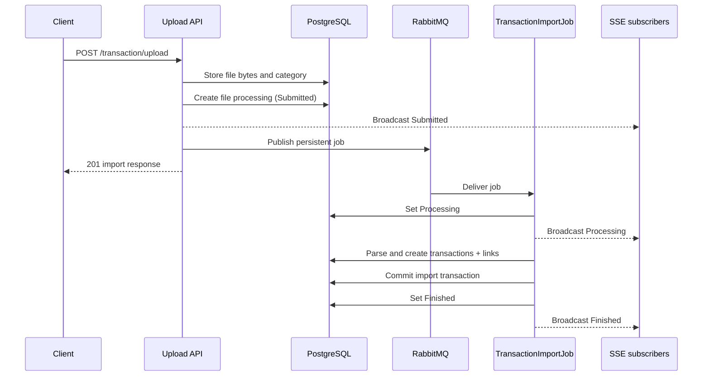
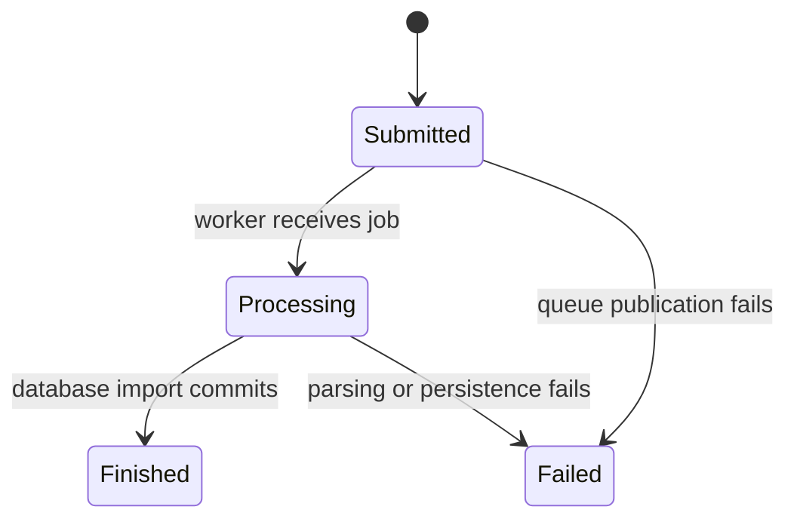

# File processing and import status

Transaction CSV imports are asynchronous. The upload request stores the original file and creates an import-tracking row, RabbitMQ hands the work to a background service, and Server-Sent Events (SSE) notify the client when the tracking status changes.

## Components and stored data

| Component | Responsibility |
| --- | --- |
| `FileModel` / `files` | Stores the original file name, complete file contents as bytes, category, and timestamps. Files are stored in PostgreSQL rather than on the local filesystem. |
| `FileProcessingModel` / `files_processing` | Tracks a file and queue job with `file_id`, `job_id`, status, and timestamps. |
| `TransactionImportModel` / `transactions_import` | Links each transaction created by an import to its file-processing row. This is the source of `transactionCount`. |
| `UploadTransactionController` | Validates and stores the upload, creates tracking state, and publishes the job. |
| `TransactionImportJob` | Consumes RabbitMQ messages, parses CSV data, creates transactions and import links, and changes status. |
| `FileProcessingService` | Reads import history, persists status transitions, builds API responses, and broadcasts changes. |
| `TransactionImportEventBroadcaster` | Fans status changes out to connected SSE subscribers inside the API process. |
| `ImportsView.vue` | Lists imports, uploads files, opens the SSE connection, and reconciles live updates with the API. |

`file_id`, `file_processing_id`, and `transaction_id` are application-level links in the current file/import schema; these models do not configure EF Core navigation properties or database foreign-key constraints.

Files are currently an internal import resource: there are no public file list, download, update, or delete endpoints. `FileService` only creates a file from an upload and retrieves it by ID for the worker. Although the model has update and soft-delete timestamps, the current workflow does not change them, so uploaded bytes remain in the database. Validation trusts the `.csv` extension rather than the MIME type; malformed CSV content is detected later by the worker and produces a `Failed` import.

## Upload and queue flow



The detailed flow is:

1. The client sends `multipart/form-data` to `POST /transaction/upload` with `File` and `Category`.
2. Validation requires a nonempty `.csv` file no larger than 10 MB and a category of `CreditCard` or `Extrato`.
3. `FileService` reads the upload into memory and saves its bytes, original name, and category in `files`.
4. The controller generates a job ID and creates a `files_processing` row with `Submitted`. This status is broadcast immediately.
5. `JobService` publishes a JSON payload containing the job, file, and processing IDs to a durable RabbitMQ queue. The message is persistent.
6. The API returns `201` with the import summary. The HTTP request does not wait for CSV parsing or transaction creation.
7. The hosted `TransactionImportJob` consumes one unacknowledged message at a time, marks the import `Processing`, loads the saved bytes, and parses the selected format.
8. Transaction creation and `transactions_import` link creation run inside a database transaction. Active duplicates are skipped, so `transactionCount` counts only newly imported rows.
9. After commit, the worker marks the import `Finished` and acknowledges the RabbitMQ message.

If queue publication fails, the controller marks the tracking row `Failed` and returns `500`. If parsing or persistence fails, the worker marks it `Failed` and negatively acknowledges the message with `requeue: false`. The current setup does not define an application retry or dead-letter flow. When the API shuts down during processing, the message remains unacknowledged so RabbitMQ can redeliver it after the channel closes.

## Status lifecycle



| Status | Meaning |
| --- | --- |
| `Submitted` | File and tracking data are stored and the job is being queued or waiting for a worker. |
| `Processing` | The worker has started parsing and creating transactions. |
| `Finished` | The database import committed successfully. |
| `Failed` | Queue publication, parsing, or processing failed. |

Every persisted status change sets `updated_at` and publishes a complete `TransactionImportResponse` containing `id`, `fileName`, `category`, `status`, `transactionCount`, `createdAt`, and `updatedAt`.

## Supported CSV formats

The selected category determines the required headers and mapping:

| Category | Required headers | Date format | Amount handling |
| --- | --- | --- | --- |
| `CreditCard` | `date`, `title`, `amount` | `yyyy-MM-dd` | Parsed using Brazilian formatting when a comma is present, otherwise invariant formatting. Positive values are converted to negative expenses; negative values remain negative. |
| `Extrato` | `Data`, `Valor`, `Identificador`, `Descrição` | `dd/MM/yyyy` | Parsed using Brazilian formatting when a comma is present, otherwise invariant formatting. The sign is preserved. `Identificador` is read but not stored on the transaction. |

Rows whose title contains `Pagamento recebido` or `Pagamento de fatura`, case-insensitively, are ignored. A transaction is also skipped when an active transaction already has the same date, title, and amount.

The implementation currently materializes both the uploaded file and parsed CSV records in memory, so the 10 MB upload limit is also an important processing bound.

## Import history API

`GET /transaction-imports` returns import summaries and supports:

- case-insensitive `search` by file name;
- `status` equal to `Submitted`, `Processing`, `Finished`, or `Failed`;
- one-based `page` and `limit` from 1 to 100;
- `order=asc|desc` by submission time.

The response includes `imports`, `page`, `limit`, `total`, and `totalPages`. Deleted file or processing rows are excluded.

`GET /transaction-imports/events` is an SSE endpoint. On connection it sends a three-second retry hint, then emits events in this form whenever a status changes:

```text
event: transaction-import-status
data: {"id":"...","fileName":"nubank.csv","category":"CreditCard","status":"Processing","transactionCount":0,"createdAt":"...","updatedAt":"..."}
```

The endpoint sends a comment heartbeat about every 15 seconds when no status event is available. Each subscriber has a bounded 20-item channel; if a slow client falls behind, the oldest pending event is dropped.

## How the client updates status

The `/imports` Vue view uses both HTTP and SSE so the database remains the source of truth:

1. On mount, it fetches the current page with `GET /transaction-imports` and opens an `EventSource` for `/api/transaction-imports/events`.
2. When the stream opens, the connection indicator changes to **Live updates** and the view performs another list fetch. This recovers changes that happened before the SSE subscription was ready.
3. For each `transaction-import-status` event, the client immediately replaces a matching visible row by ID.
4. It schedules a list reconciliation 150 ms later. The fetch adds newly submitted rows when they belong on the current page and reapplies search, status, ordering, and pagination rules.
5. When the stream errors, the indicator changes to **Reconnecting**. The browser's `EventSource` reconnects automatically, using the server's retry hint; a successful reconnect performs another reconciliation fetch.
6. After a successful upload, the client returns to page one and refreshes the list even if the earlier `Submitted` event was missed.
7. On component unmount, the client closes the event stream and clears pending timers.

Malformed SSE JSON is ignored because the next reconciliation fetch restores authoritative state. The view also provides a manual **Refresh** action.

The broadcaster is in-memory and process-local. With multiple API instances, an SSE client only receives events published by its connected instance. The initial and reconnect fetches reduce stale state, but reliable cross-instance live delivery would require shared pub/sub (for example Redis) or equivalent routing and periodic reconciliation.

## Code map

- Upload endpoint: `api/Controllers/Transaction/UploadTransactionController.cs`
- Import list and SSE endpoints: `api/Controllers/Transaction/ListTransactionImportController.cs` and `StreamTransactionImportController.cs`
- File persistence: `api/Models/File` and `api/Services/File`
- Processing state: `api/Models/FileProcessing` and `api/Services/FileProcessing`
- RabbitMQ publisher and worker: `api/Services/Job`
- Import provenance: `api/Models/TransactionImport` and `api/Services/TransactionImport`
- Client API and status stream: `client/src/api/finance.ts`
- Client imports view: `client/src/views/ImportsView.vue`
